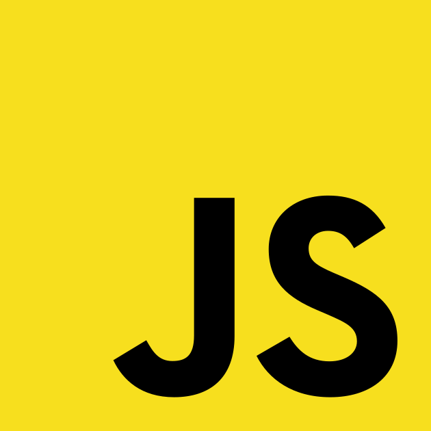
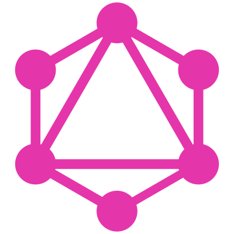
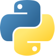
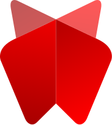

###### [EN] / [RU]

<!--  -->

<!---->

## Tech Stack

 

  
  &ensp;
  
  &ensp;
  
  &ensp;
  
  &ensp;
  
  &ensp;
  
  &ensp;
  
  &ensp;
  
  &ensp;
  
  &ensp;
  
  &ensp;
  <!--  -->

 

More Skills

 

<!--  

  

 -->

[EN]: ./README.md
[RU]: ./README.ru.md
