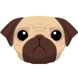
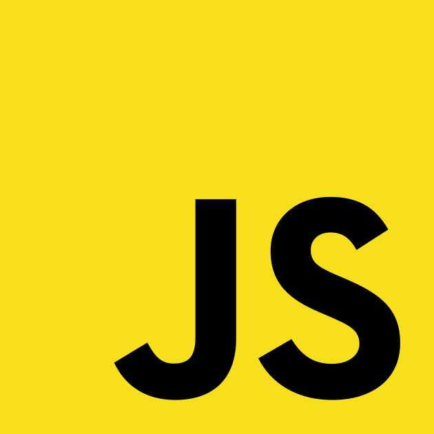

###### [RU] / [EN]

<!--  -->

<!---->

## Стек технологий

 

  
  &ensp;
  
  &ensp;
  
  &ensp;
  
  &ensp;
  
  &ensp;
  
  &ensp;
  
  &ensp;
  
  &ensp;
  
  &ensp;
  
  &ensp;
  <!--  -->

 

  

[EN]: ./README.md
[RU]: ./README.ru.md
